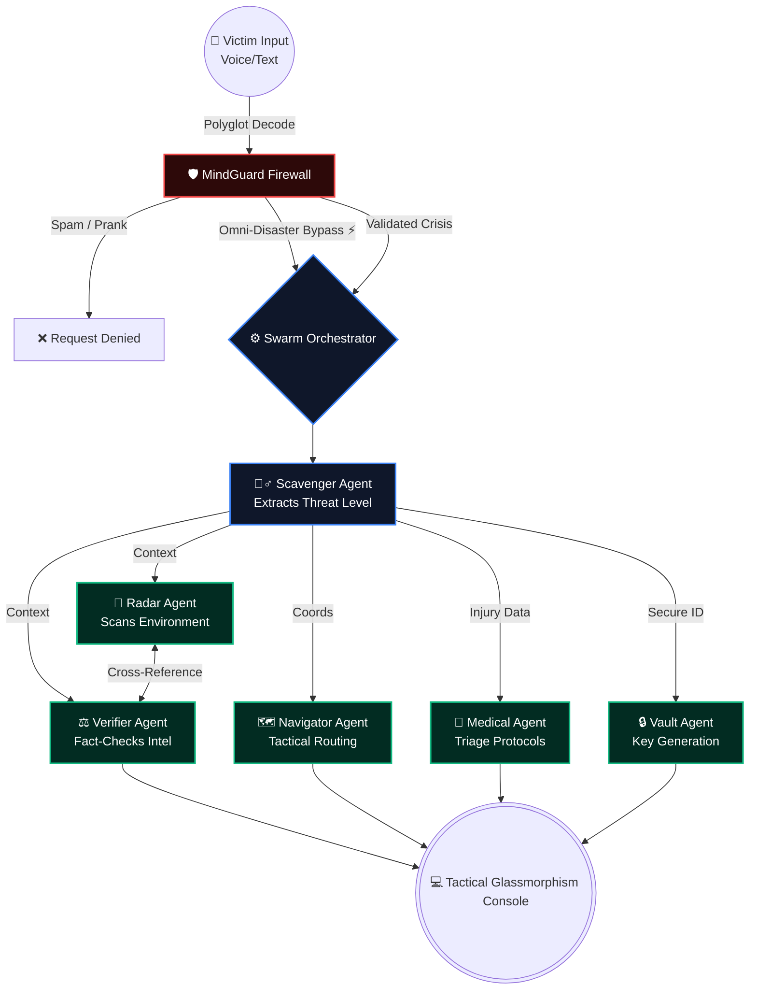

<div align="center">
  
  <h1>ChayRa AI</h1>
  <br><p>
    <a href="https://chayra-ai.vercel.app" target="_blank">
      
    </a>
    
    
    
  </p>
  <p><em>Engineered by Ranajit Dhar • When the World Breaks, ChayRa Responds.</em></p>
</div>

---

## ⚡ Judge TL;DR (30-Second Overview)

**ChayRa AI is not just a chatbot. It is an autonomous, hyper-local crisis response swarm.**

We are building the ultimate digital safety net for zero-hour emergencies, turning **panicked, multilingual voice commands into coordinated survival intelligence.**

* **🎙️ Polyglot Voice-to-Action Protocol:** Built-in military-grade voice command processing. Victims can speak naturally in extreme stress (**100+ Local Languages**), and the system autonomously decodes, translates, and triggers the rescue swarm.
* 🗺️ **25km Tactical Routing (Navigator):** Automatically scans a 25km radius via OpenStreetMap to pinpoint verified hospitals, civilian shelters, or military bunkers, generating a secure evacuation route from the user's live location.
* ⚕️ **Live AI Triage (Medical Agent):** Instantly analyzes trauma context to generate life-saving first-aid steps and medication suggestions. Features a robust offline fallback lifeline protocol if connectivity drops.
* 🛡️ **Offline-First Mesh Network (Vault Agent):** Generates secure alphanumeric rescue beacons and autonomously instructs victims to utilize Bluetooth/WiFi Direct for peer-to-peer distress pings when traditional cell towers collapse.
* **🔌 3-Tier Auto-Failover Circuit Breaker:** Robust backend logic ensures that if the primary LLM brain fails or hallucinates, the system seamlessly falls back to a secondary module or a "Trust-User" default state(**Gemini 3 Pro` ➔ `Groq Llama 3` ➔ `HF Qwen**). False negatives are fatal in emergencies, so ChayRa guarantees uninterrupted execution.
* **📍 Tactical Pin Drop & Live GPS:** Victims can transmit their live location via secure GPS handshakes or utilize the "Drop Pin" feature on a tactical map when GPS is spoofed or compromised.
* 🔍 **Live Rumor Verification:** A dedicated intel search bar allows victims to instantly fact-check local news and dispel panic-inducing misinformation during the chaos of a crisis.
* **💻 Glassmorphism Tactical Console:** A premium, dark-themed, military-grade UI with dynamic glow states, real-time latency tracking, and autonomous agent processing indicators.

---

<div align="center">
  <h2>🌍 The Mission & Inspiration: Why build ChayRa AI?</h2>
</div>

> *Every year, millions are caught in the chaotic crossfire of natural disasters, wars, and humanitarian crises. In these zero-hour moments, the greatest enemy isn't just the disaster itself—**it is the delay of information, the collapse of networks, and paralyzing language barriers.***
> 
> *If a standard AI denies help because it "couldn't find recent news" about a hyper-local drone strike, that **false negative is fatal.***

<div align="center">
  <h3>💥 I refused to accept that. <i>I asked myself: "What if an AI system could act before panic spreads?"</i></h3>
</div>

* **What if** trapped civilians could instantly receive tactical evacuation routes?
* **What if** life-saving medical triage could be generated instantly, bypassing overloaded human dispatchers?
* **What if** a refugee could transmit distress signals in their native tongue and be understood flawlessly?

<div align="center">
  <br>
  <p>That vision became <b>ChayRa AI</b>. It is not just another conversational dashboard; it is an <b>autonomous multi-agent crisis response swarm</b> engineered to assist humanity during its most vulnerable seconds. From active threat detection to polyglot emergency broadcasting, every line of code serves one mission: protecting lives when traditional infrastructure fails.</p>
  
  <p>In a future where disasters are accelerating, intelligent coordination systems will become essential digital infrastructure.</p>
  
  <br><b>🛡️ I am not building AI for convenience. I am building AI for resilience.</b>
</div>

---

## 🚀 The Architecture: Autonomous Multi-Agent Swarm
Unlike traditional monolithic LLMs, ChayRa AI operates on a **Swarm Architecture**. It utilizes an Evaluator-Optimizer loop where specialized micro-agents communicate, verify, and execute critical tasks in parallel. 

### 🧠 The Core Agents (`src/core/agents/`)
1. **🛡️ MindGuard (The Firewall):** The gatekeeper. Prevents system abuse and features an **Omni-Disaster Fast-Pass**. It uses heuristic regex bypasses to instantly approve critical physical threats (bombings, earthquakes, tsunami) without waiting for slow news/API validations.
2. **🕵️‍♂️ Scavenger:** Extracts critical context, calculates the Threat Level (CRITICAL, HIGH, LOW), and tags required agents dynamically.
3. **📡 Radar:** Scans external environment APIs and environment parameters to establish the physical context of the crisis.
4. **⚖️ Verifier:** The Fact-Checker. Cross-references the victim's claim with Radar Intel to prevent hallucinations and establish an intelligence confidence score.
5. **🏥 Medical:** Generates immediate, life-saving triage protocols based on the extracted injury/disaster context.
6. **🗺️ Navigator:** Processes exact GPS coordinates or manual pin drops to map out tactical evacuation and routing protocols.
7. **🔒 Vault:** Manages secure identity and generates emergency beacons.

---

## 🧠 Autonomous Swarm Architecture Flow

The core of ChayRa AI relies on a highly specialized Evaluator-Optimizer loop. Here is the visual breakdown of our Multi-Agent Swarm execution:



## ⚙️ The Tech Stack & Directory Structure

ChayRa AI relies on a highly modular, serverless edge-optimized infrastructure. We bypassed monolithic designs for pure cloud-native speed and 100% uptime.

* **Frontend & Console:**   
* **The Intelligence Swarm (3-Tier):**   
* **Live Intel & Radar APIs:** -748B75?style=for-the-badge&logo=openstreetmap&logoColor=white) 
* **Polyglot & Telemetry:**  
* **Infrastructure:**  

### 📂 Core Directory Architecture

```text
📦 CHAYRA-AI
 ┣ 📂 src
 ┃ ┣ 📂 app
 ┃ ┃ ┣ 📂 api              # Serverless Edge Endpoints (crisis-zones, swarm, verify, voice)
 ┃ ┃ ┣ 📜 globals.css      # Custom Tailwind & Glassmorphism styles
 ┃ ┃ ┣ 📜 layout.tsx       # Root Next.js layout structure
 ┃ ┃ ┗ 📜 page.tsx         # Main Command Center UI
 ┃ ┣ 📂 components         # UI Modules (ActionPanel, HelpBar, MapCore, MapWidget)
 ┃ ┣ 📂 core
 ┃ ┃ ┣ 📂 agents           # The Micro-Agents (medical, mindguard, navigator, radar, scavenger, vault, verifier, base.ts)
 ┃ ┃ ┗ 📂 brain            # Central LLM processing (brain.ts) & 3-Tier failover logic
 ┃ ┗ 📂 lib                # Shared utility functions (utils.ts)
 ┣ 📜 .env.local           # Master API Keys (Gemini, Groq, HF, SerpAPI)
 ┣ 📜 AGENTS.md            # Documentation for Agent prompts and behaviors
 ┗ 📜 package.json         # Project dependencies & scripts
```

---


## 🚀 Quick Start & Technical Verification (For Judges)

<div align="center">
  <br>
  <a href="https://chayra-ai.vercel.app" target="_blank">
    
  </a>
  <br><br>
  <em>Note: Judges can test the system's full polyglot voice capabilities and swarm intelligence directly via the Live Edge URL above.<br>This section is strictly for open-source technical verification.</em>
</div>

### 1. Clone & Install
```bash
git clone [https://github.com/ranajitdharpersonal/chayra-ai.git](https://github.com/ranajitdharpersonal/chayra-ai.git)
cd chayra-ai
npm install
```

### 2. The Master Keys (`.env.local`)
To ignite the 3-Brain Swarm locally, create a `.env.local` file and configure the following environment variables:

```env
GEMINI_API_KEY=your_primary_brain_key
GROQ_API_KEY=your_llama3_failover_key
HF_TOKEN=your_survival_key
SERPAPI_API_KEY=live_rumor_verification_key
# Note: Overpass API (OpenStreetMap) is used for routing and does not require an API key!
```

### 3. Ignite the Engine
```Bash
npm run dev
```

---

## 👨‍💻 The Architect

**Ranajit Dhar**
* *AI & Multi-Agent Systems Architect | Pioneering Autonomous Crisis Response*
* **Copyright (c) 2026 Ranajit Dhar.**

**⭐ Final Note:**
> ChayRa AI is not just a tool; it is a proof-of-concept for a future where humanity is protected by intelligent, autonomous swarms when traditional infrastructure collapses. 
> <br><br>**Welcome to the next generation of crisis response.**
